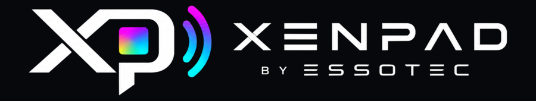

# Hey there 👋 I'm Esso

**CTO & Solution Architect** building AI-powered products, SaaS platforms, and Web3 infrastructure.

Based in Hamburg, Germany 🇩🇪 — working with European startups and scale-ups to turn complex ideas into scalable products.

---

### 🚀 What I'm Building

<a href="https://xenpads.com">
  
</a>

#### Buttons you press, and that press back

Desk hardware that works in **both directions**. Pressing runs something on your
computer; an event from the internet — a failed build, a page going down,
someone mentioning you — lights the device up. Two of them exist:

**XENPAD One** — a single mechanical switch with a full-colour indicator, on an
RP2040. Three gestures, each mapped independently, and a resting colour that
tells you the state of whatever it is watching.

**XENPAD Omni** — a round touchscreen on an ESP32-S3 with a rotary encoder and
an RGB ring. Tiles, layers, and alerts that take over the whole glass with the
actual message rather than a coloured dot. Press it and it opens the exact thing
that raised the alert.

The whole desk side is mine: firmware for both chips, a signed and notarized
macOS app, and the relay that carries events from the internet to a device
sitting behind someone's router.

**The firmware for both is open source:**

- [`xenpad-firmware`](https://github.com/xenpads/xenpad-firmware) — XENPAD One,
  RP2040, GPLv3
- [`xenpad-omni-firmware`](https://github.com/xenpads/xenpad-omni-firmware) —
  XENPAD Omni, ESP32-S3, GPLv3
- [`xenpad-app-releases`](https://github.com/xenpads/xenpad-app-releases) —
  the desktop app, macOS, universal build

The USB protocol is MIT in both, so anything can talk to the devices without
inheriting copyleft. That split is deliberate: the shortcuts live in the
device's own flash, so a button keeps working on a machine that has never seen
my software — and if I stop, someone else can build the firmware and write a
replacement app.

`C` · `C++` · `RP2040` · `ESP32-S3` · `TinyUSB` · `LVGL` · `Electron` · `NestJS`

---

#### ✈️ [Skydex](https://skydex.online) — a flight sim where the traffic is real

Open a browser tab and you are over the real Earth: real terrain, real
photogrammetry where it exists, real weather for that city, real sunrise. The
aircraft around you are not spawned — they are the ones actually in the air,
decoded from ADS-B seconds ago. So are the ships below, from AIS.

Three things run at the same time, and each one feeds the next:

**Fly it.** Freestyle FPV drones and a gull, six-degree-of-freedom flight
model, acro and angle modes, gamepad/RC transmitter support with a calibration
wizard, and 19 hand-built race tracks with ghost replays and leaderboards.
Also playable in VR on Quest through WebXR.

**Collect it.** Every real aircraft you catch overhead becomes a card — six
rarity tiers, fifteen ranks, monthly seasons, achievements, an inbox that
remembers why you got what you got. Types, airlines and manufacturers get
their own canonical pages, so a catch turns into a permanent, indexable page
about a real machine. Around 1,800 public URLs at the moment; the game
itself speaks five languages.

**Feed it.** The aircraft data is ours: Skydex runs its own ADS-B aggregation
network at [feed.skydex.online](https://feed.skydex.online/) — volunteers
point a receiver at it, get a station page with uptime, range and the rarest
aircraft they heard, and a badge in the game. Non-exclusive by design: keep
feeding every other network at the same time. Getting a receiver onto it is a
product of its own — see below.

Around all of that: multiplayer with voice on real airband frequencies over a
WebRTC mesh, user-run radio stations with their own studio, a flying-spots
map built from OpenStreetMap, and a self-hosted observability stack — the
whole thing lives on one small VPS and deploys itself from `master`.

**Not the frozen one.** There is an older Skydex — a React Native "Pokédex for
planes" I started in 2025 and put on ice. This is the rebuild: same idea, but
the sky is a place you fly through rather than a list you scroll, and the data
comes from a network we operate instead of someone's API quota.

- 🌍 [`skydex.online`](https://skydex.online) — the game
- 📡 [`feed.skydex.online`](https://feed.skydex.online/) — the feeder network
  · [live coverage map](https://feed.skydex.online/tar1090/)
  · [stations](https://skydex.online/stations)
- 🖥 [`es-ua/skydex-feeder`](https://github.com/es-ua/skydex-feeder) — macOS
  feeder app: releases, checksums and the GPL decoder sources we bundle
  · [⬇ download](https://feed.skydex.online/download)
- 📻 [`radio.skydex.online`](https://radio.skydex.online/) — community radio
  stations · 🖼 [`gallery`](https://gallery.skydex.online/) · 📍
  [`spots`](https://spots.skydex.online/) — real-world FPV flying spots
- 🏁 [races](https://skydex.online/races) · ✈️
  [aircraft types](https://skydex.online/aircraft-types) · 📰
  [dev log](https://skydex.online/news/)

`TypeScript` · `React` · `three.js` · `WebGL` · `WebXR` · `NestJS` · `MongoDB` · `Socket.IO` · `WebRTC` · `Next.js` · `Swift` · `Docker` · `nginx` · `Grafana`

---

#### 📡 [Skydex Feeder for macOS](https://feed.skydex.online/mac) — an SDR stick, two minutes, no Raspberry Pi

Feeding ADS-B has always assumed a spare Raspberry Pi, an install script and a
terminal, which is why most people who own an SDR stick have never fed anything
with it. This is a native menu bar app instead: plug the stick into the Mac you
already use, run a two-minute wizard, and it is a receiving station. The
decoder is bundled — no Docker, no terminal, no second computer.

Universal binary for Apple silicon and Intel, signed with a Developer ID and
notarized, and it updates itself. Updates carry **our** signature on top of
Apple's notarisation, because the two answer different questions: notarisation
says the file came from us and is clean, the update signature says *this
particular update* is the one we published — a swapped file is refused even
when it is served from our own domain.

**It is not a lock-in client.** Skydex sits in the same list of toggles as
adsb.lol, airplanes.live, adsb.fi and ADSBExchange, with a field for anything
else that takes a Beast stream — and it can be switched off while the others
keep feeding. "Check my feed" asks the network itself what it is receiving from
your station, because a connected socket only proves the app is talking.

**Closed app, open decoder — on purpose.** The repository is the
corresponding-source offer: the app bundles
[readsb](https://github.com/wiedehopf/readsb) (GPL-3.0-or-later) statically
linked with librtlsdr and libusb, and `scripts/build-readsb.sh` fetches the
exact upstream sources and reproduces the universal binary we ship, carrying no
patches of our own. Every release lists the version of every bundled component
and the **SHA-256 of the DMG**, so a download from the site can be verified
against what the repo declares.

- 🖥 [`es-ua/skydex-feeder`](https://github.com/es-ua/skydex-feeder) — release
  notes, checksums, decoder sources, issues
- ⬇ [download](https://feed.skydex.online/download) — signed & notarized DMG,
  macOS 13+ · [product page & FAQ](https://feed.skydex.online/mac)
- 📡 [what it feeds](https://feed.skydex.online/) · [your station's
  page](https://skydex.online/feed)

`Swift` · `macOS` · `RTL-SDR` · `readsb` · `Sparkle` · `codesign` · `notarytool`

---

<table>
  <tr>
    <td width="50%">
      <h3>🔗 <a href="https://y0.exchange">y0.exchange</a></h3>
      <p>Non-custodial crypto platform & MCP server — the AI interface layer for blockchain. Connect any wallet to AI agents without exposing private keys.</p>
      <p><a href="https://www.npmjs.com/package/@y0exchange/mcp"><code>@y0exchange/mcp</code></a> — 8 tools, 5 chains, dual transport (stdio + HTTP). Includes a <a href="https://github.com/y0exchange/mcp/tree/main/skill">Claude Skill</a> for guided DeFi workflows with smart slippage, gas optimization, and safety checks.</p>
      <p><code>TypeScript</code> <code>Web3</code> <code>MCP</code> <code>Claude Skill</code> <code>React</code></p>
    </td>
    <td width="50%">
      <h3>📊 <a href="https://citenso.com">Citenso</a></h3>
      <p>AI Visibility Tracking — monitor how ChatGPT, Claude, Perplexity and other AI models recommend your brand vs competitors.</p>
      <p><code>Next.js</code> <code>Python</code> <code>AI/LLM</code> <code>SaaS</code></p>
    </td>
  </tr>
  <tr>
    <td width="50%">
      <h3>🗺️ Mapko</h3>
      <p>Location-based social platform with omnichannel CRM — map discovery, community chats, business listings with integrated customer management.</p>
      <p><code>Next.js</code> <code>PostgreSQL</code> <code>WebSocket</code> <code>React Native</code></p>
    </td>
    <td width="50%">
      <h3>🔍 SERPOscan</h3>
      <p>AI-powered SEO audit tool — comprehensive technical analysis, performance scoring, and actionable recommendations.</p>
      <p><code>Node.js</code> <code>Lighthouse</code> <code>SEO</code></p>
    </td>
  </tr>
</table>

---

### 🤖 Side Quest: Flathead Robot

Building a **Cyberpunk 2077-inspired robot** from scratch — 3D printed chassis, stereo vision, ESP32 + Raspberry Pi 5, autonomous navigation with ROS 2, LED eye animations, and AI-powered human interaction.

Printing on **Bambu Lab A1 Mini** 🖨️ | Materials: PETG-CF, TPU

---

### 🛠️ Tech Stack

**Languages & Frameworks**
```
TypeScript · JavaScript · Python · Swift · SwiftUI · Rust
React · Next.js · Vue.js · React Native · Node.js · Express
```

**Cloud & DevOps**
```
AWS · Google Cloud · Docker · Jenkins · GitHub Actions · Vercel
```

**Data & Backend**
```
PostgreSQL · MongoDB · Redis · Supabase · Firebase · Strapi CMS · Prisma
```

**Blockchain & Web3**
```
Ethers.js · Wagmi · Reown · 1inch · 0x Protocol · LI.FI · MCP
```

**Automation & AI**
```
n8n · LangChain · OpenAI API · Anthropic API · Claude MCP
```

---

### 📜 Certifications

- Salesforce Certified Platform Developer I
- Salesforce Certified Administrator

---

### 📫 Let's Connect

<p>
  <a href="https://esso.dev"></a>
  <a href="https://x.com/esso_dev"></a>
  <a href="https://y0.exchange"></a>
  <a href="https://www.reddit.com/r/esso_dev/"></a>
</p>

---

<p align="center">
  
  
  
  
</p>

---

<p align="center"><i>💡 Ask me about CRM, iOS, project management, AI integrations, or non-custodial crypto infrastructure</i></p>
